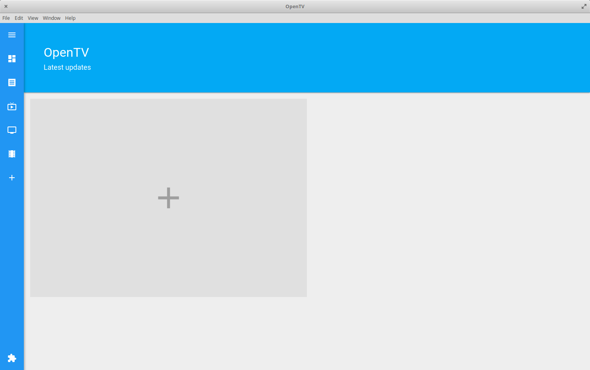

# OpenTV

Open source TV for the 21st century.



## Installation

To get started, clone the repo to your target directory.

In one terminal run: 
```bash
npm build
```
to build the TypeScript files in watchmode.

In another terminal run
```bash
npm run electron
```
to start the Electron app